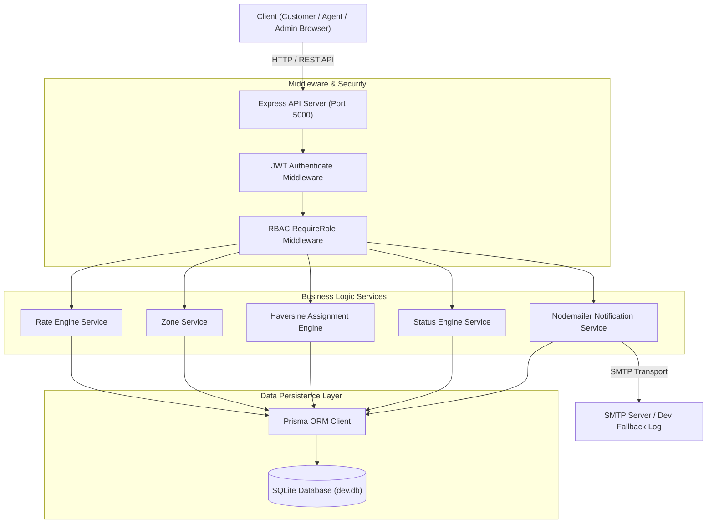

# Last-Mile Delivery Tracker

A full-stack, enterprise-grade Last-Mile Delivery Tracker platform designed to manage end-to-end logistics operations across three role levels: **Customer**, **Delivery Agent**, and **Admin**. 

The platform implements an automated operational pipeline: Order Creation & Zone Resolution (via pincode lookup) $\rightarrow$ Rate Engine Calculation (volumetric vs actual weight, B2B/B2C, INTRA/INTER zone slabs, COD surcharges) $\rightarrow$ Order Confirmation $\rightarrow$ Haversine Distance-Based Agent Auto-Assignment $\rightarrow$ Real-Time Status Tracking Lifecycle $\rightarrow$ Nodemailer Email Notifications $\rightarrow$ Rescheduling & Re-assignment for failed delivery attempts.

---

## 1. Features

### Customer
- **Authentication**: Customer registration and JWT sign-in.
- **Shipment Booking**: Order creation with pickup and drop addresses, dimensions ($L \times B \times H$), and actual weight.
- **Pricing Preview Engine**: Real-time breakdown of volumetric weight, chargeable weight, base freight, and COD surcharge prior to booking.
- **Shipment Tracking**: Visual node timeline tracking order lifecycle status updates.
- **Failed Delivery Rescheduling**: Re-scheduling date selection for failed delivery attempts, which resets order status to `BOOKED` and triggers automatic agent re-assignment.

### Delivery Agent
- **Authentication**: Agent sign-in.
- **Delivery Roster**: Dedicated dashboard displaying assigned delivery jobs.
- **Duty Availability**: Real-time duty availability toggle (`is_available`, `is_active`).
- **Geographic Location**: Coordinate tracking (`latitude`, `longitude`) used for distance calculation.
- **Sequential Status Transitions**: State machine enforcement (`BOOKED` $\rightarrow$ `PICKED_UP` $\rightarrow$ `IN_TRANSIT` $\rightarrow$ `OUT_FOR_DELIVERY` $\rightarrow$ `DELIVERED` or `FAILED`).

### Admin
- **Operations Control Center**: Platform-wide metrics (total orders, unassigned, failed attempts, delivered).
- **Order Management & Filtering**: Filter orders by status, zone, or agent.
- **Admin Status Override**: Mandatory reason-backed status transitions for operational corrections.
- **Zone & Area Management**: CRUD operations for operational zones and pincode-to-zone mappings.
- **Rate Matrix Management**: Configurable weight slabs, base prices, and per-kg rates across B2B/B2C and INTRA/INTER zone relations.
- **COD Configuration**: Configurable flat or percentage-based COD surcharges per order type.
- **Agent Roster Administration**: Provisioning agent accounts, zone assignments, and duty status controls.
- **Assignment Engine**: Manual agent dispatch and automatic nearest-agent assignment based on great-circle Haversine distance.

---

## 2. Tech Stack

### Frontend
- **Framework**: React 18.3 (`react-dom`, `react-router-dom` v6)
- **Language**: TypeScript 5.4
- **Build Tool**: Vite 5.3
- **Styling**: Vanilla CSS with TailwindCSS 3.4 (Geist-style Dark Base `#050505`, Electric Yellow `#F5C518`, Light Purple `#C4B5FD` design philosophy)
- **State & API**: Axios 1.7 HTTP client, Context API, Lucide React icons

### Backend
- **Runtime**: Node.js v20.x
- **Framework**: Express 4.19
- **Language**: TypeScript 5.5 (`tsx` execution)
- **Authentication**: JSON Web Token (`jsonwebtoken` 9.0) with bcrypt password hashing (`bcryptjs` 2.4)
- **Validation**: Zod 3.23 schema validation

### Database
- **Database**: SQLite (`dev.db`)
- **ORM**: Prisma ORM 5.19 with type-safe client definitions and cascade relations

### Notifications
- **Email Engine**: Nodemailer 6.9 SMTP transport (supports live SMTP via Ethereal / SendGrid / Brevo or dev fallback console logging) with `Notification` database tracking

### Testing
- **Test Framework**: Vitest 1.6 runner (isolated fork pool execution)

### Deployment
- **Configuration**: Standard Node.js production bundle build (`tsc` + `vite build`)

---

## 3. Project Structure

```text
LastMile/
├── backend/
│   ├── prisma/
│   │   ├── schema.prisma        # Prisma ORM models and database schema
│   │   ├── seed.ts              # Seed script for demo accounts, zones, rate cards
│   │   └── dev.db               # SQLite database file
│   ├── src/
│   │   ├── controllers/         # HTTP request handlers (auth, order, admin, pricing, zone)
│   │   ├── middleware/          # JWT authentication and RBAC authorization
│   │   ├── routes/              # Express API route declarations
│   │   ├── services/            # Core business logic (rate engine, assignment, status, etc.)
│   │   ├── tests/               # Vitest integration and unit test suite
│   │   ├── types/               # TypeScript interface definitions
│   │   └── index.ts             # Express application entry point
│   ├── package.json
│   ├── tsconfig.json
│   └── .env.example
├── frontend/
│   ├── src/
│   │   ├── api/                 # Axios instance and API interceptors
│   │   ├── components/          # Reusable UI components (Navbar, Sidebar, Badge, Timeline, Modal, Input)
│   │   ├── context/             # React AuthContext provider
│   │   ├── pages/               # Role-based pages (auth, customer, agent, admin)
│   │   ├── types/               # Frontend TypeScript interfaces
│   │   ├── App.tsx              # React application routing
│   │   └── index.css            # Global CSS design tokens and utility classes
│   ├── package.json
│   ├── vite.config.ts
│   └── tailwind.config.js
├── package.json                 # Monorepo root package scripts
├── .env.example                 # Root environment variables configuration template
├── README.md                    # Project documentation
└── SYSTEM_DESIGN.pdf            # System design write-up
```

---

## 4. Prerequisites

- **Node.js**: `v20.x` or higher
- **npm**: `v10.x` or higher
- **Git**: Installed on host system

---

## 5. Setup Guide

### Step 1 — Clone Repository
```bash
git clone https://github.com/swanandagupta/LastMile.git
cd LastMile
```

### Step 2 — Install Dependencies
Install dependencies for root, backend, and frontend:
```bash
# Install root orchestration packages
npm install

# Install backend dependencies
cd backend && npm install && cd ..

# Install frontend dependencies
cd frontend && npm install && cd ..
```

### Step 3 — Environment Variables
Copy `.env.example` to `backend/.env`:
```bash
cp backend/.env.example backend/.env
```

### Step 4 — Database Setup
Initialize SQLite database schema and seed initial data (demo accounts, operational zones, rate cards, COD configs):
```bash
# Generate Prisma Client and push schema to dev.db
npm --prefix backend run db:push

# Run seed script
npm --prefix backend run db:seed
```

### Step 5 — Start Backend API
```bash
npm run dev:backend
```
Backend server will run at `http://localhost:5000`.

### Step 6 — Start Frontend Application
In a separate terminal:
```bash
npm run dev:frontend
```
Frontend development server will run at `http://localhost:5173`. Or start both concurrently from the root directory:
```bash
npm run dev
```

### Step 7 — Access Application
- **Frontend App**: `http://localhost:5173`
- **Backend API Base**: `http://localhost:5000/api`

---

## 6. Environment Variables

Documented variables in `.env.example`:

| Variable | Purpose | Example / Format | Required |
| --- | --- | --- | --- |
| `PORT` | Express server HTTP port | `5000` | Required |
| `DATABASE_URL` | Prisma database connection string | `file:./dev.db` | Required |
| `JWT_SECRET` | Secret key for signing JWT tokens | `your-super-secret-jwt-key` | Required |
| `JWT_EXPIRES_IN` | JWT token expiration lifespan | `7d` | Required |
| `CORS_ORIGIN` | Allowed client origin URL for CORS | `http://localhost:5173` | Required |
| `SMTP_HOST` | SMTP server hostname for email notifications | `smtp.ethereal.email` | Optional (Dev fallback if omitted) |
| `SMTP_PORT` | SMTP port number | `587` | Optional |
| `SMTP_USER` | SMTP authentication username | `user@ethereal.email` | Optional |
| `SMTP_PASS` | SMTP authentication password | `password` | Optional |
| `SMTP_FROM` | Sender address for outbound email dispatch | `noreply@deliverytracker.com` | Optional |

---

## 7. Authentication & Authorization

Authentication is handled via JSON Web Tokens (JWT). Passwords are hashed using `bcryptjs` with 10 salt rounds.

### Authentication Flow
1. User registers via `POST /api/auth/register` or logs in via `POST /api/auth/login`.
2. Server validates credentials, generates JWT containing `{ userId, role }`, and returns user object with bearer token.
3. Client stores token and sends `Authorization: Bearer <token>` header with HTTP requests.

### Role-Based Access Control (RBAC)
Server-side authorization is enforced in Express middleware (`auth.middleware.ts`):
- **`authenticate`**: Verifies JWT signature and attaches `req.user` context.
- **`requireRole(...roles)`**: Restricts route access to specific roles (`CUSTOMER`, `AGENT`, `ADMIN`).

| Role | Permissions |
| --- | --- |
| **CUSTOMER** | Create orders, preview pricing, view own orders, track status, reschedule failed deliveries. |
| **AGENT** | View assigned delivery roster, toggle duty availability (`is_available`), update sequential delivery status (`BOOKED` $\rightarrow$ `PICKED_UP` $\rightarrow$ `IN_TRANSIT` $\rightarrow$ `OUT_FOR_DELIVERY` $\rightarrow$ `DELIVERED`/`FAILED`). |
| **ADMIN** | Full system access: manage zones/areas, rate cards, COD configs, agent roster, view all orders, trigger auto-assignment, perform manual assignment, execute status overrides. |

---

## 8. API Documentation

### Route Summary

#### Authentication (`/api/auth`)
| Method | Endpoint | Auth | Role | Purpose |
| --- | --- | --- | --- | --- |
| `POST` | `/register` | Public | None | Register new customer account |
| `POST` | `/login` | Public | None | Authenticate user & issue JWT |
| `GET` | `/me` | Bearer | Any | Retrieve current authenticated user profile |

#### Pricing (`/api/pricing`)
| Method | Endpoint | Auth | Role | Purpose |
| --- | --- | --- | --- | --- |
| `POST` | `/preview` | Bearer | Any | Calculate volumetric weight, chargeable weight, and freight preview |

#### Orders & Tracking (`/api/orders`)
| Method | Endpoint | Auth | Role | Purpose |
| --- | --- | --- | --- | --- |
| `POST` | `/` | Bearer | Customer/Admin | Book a new shipment order |
| `GET` | `/` | Bearer | Any | List orders (filtered by customer/agent/admin role) |
| `GET` | `/:id` | Bearer | Any | Get order details by ID |
| `GET` | `/:id/tracking` | Bearer | Any | Get order tracking timeline & status history |
| `PATCH` | `/:id/status` | Bearer | Agent/Admin | Update order status (with reason validation) |
| `POST` | `/:id/reschedule` | Bearer | Customer/Admin | Reschedule delivery date for a failed order |
| `POST` | `/:id/assign/auto` | Bearer | Admin | Trigger Haversine distance-based auto-assignment |
| `POST` | `/:id/assign/manual` | Bearer | Admin | Manually assign specific agent to order |

#### Zones & Areas (`/api`)
| Method | Endpoint | Auth | Role | Purpose |
| --- | --- | --- | --- | --- |
| `GET` | `/zones` | Bearer | Any | List all operational zones |
| `GET` | `/zone-areas` | Bearer | Any | List all pincode-to-zone mappings |
| `POST` | `/zones` | Bearer | Admin | Create operational zone |
| `PATCH` | `/zones/:id` | Bearer | Admin | Update operational zone |
| `DELETE` | `/zones/:id` | Bearer | Admin | Delete operational zone |
| `POST` | `/zone-areas` | Bearer | Admin | Map pincode to zone |
| `PATCH` | `/zone-areas/:id` | Bearer | Admin | Update pincode mapping |
| `DELETE` | `/zone-areas/:id` | Bearer | Admin | Delete pincode mapping |

#### Admin & Rate Matrix (`/api`)
| Method | Endpoint | Auth | Role | Purpose |
| --- | --- | --- | --- | --- |
| `PATCH` | `/agents/me/availability` | Bearer | Agent | Toggle agent self availability status |
| `GET` | `/rate-cards` | Bearer | Admin | List all rate card weight slabs |
| `POST` | `/rate-cards` | Bearer | Admin | Create rate card weight slab |
| `PATCH` | `/rate-cards/:id` | Bearer | Admin | Update rate card weight slab |
| `DELETE` | `/rate-cards/:id` | Bearer | Admin | Delete rate card weight slab |
| `GET` | `/cod-config` | Bearer | Admin | List COD surcharge configurations |
| `PUT` | `/cod-config/:orderType` | Bearer | Admin | Upsert COD surcharge config for B2B/B2C |
| `GET` | `/agents` | Bearer | Admin | List delivery agent roster |
| `POST` | `/agents` | Bearer | Admin | Provision new delivery agent account |
| `PATCH` | `/agents/:id` | Bearer | Admin | Toggle agent account active status |

---

### Representative Request / Response JSON Examples

#### 1. Pricing Preview (`POST /api/pricing/preview`)
**Request:**
```json
{
  "pickupPincode": "110001",
  "dropPincode": "560002",
  "lengthCm": 40,
  "breadthCm": 30,
  "heightCm": 20,
  "actualWeightKg": 3.5,
  "orderType": "B2C",
  "paymentType": "COD"
}
```
**Response:**
```json
{
  "volumetricWeightKg": 4.8,
  "chargeableWeightKg": 4.8,
  "pickupZone": { "id": "zone-delhi-id", "name": "North Express Zone" },
  "dropZone": { "id": "zone-[#C4B5FD]-id", "name": "South Coast Zone" },
  "zoneRelation": "INTER",
  "rateCard": { "id": "rc-inter-b2c", "base_price": 100, "rate_per_kg": 15 },
  "baseCharge": 172,
  "codSurcharge": 20,
  "totalCharge": 192
}
```

#### 2. Create Order (`POST /api/orders`)
**Request:**
```json
{
  "pickupLine1": "110 Connaught Place",
  "pickupCity": "New Delhi",
  "pickupState": "Delhi",
  "pickupPincode": "110001",
  "dropLine1": "45 Koramangala 4th Block",
  "dropCity": "Bengaluru",
  "dropState": "Karnataka",
  "dropPincode": "560002",
  "lengthCm": 40,
  "breadthCm": 30,
  "heightCm": 20,
  "actualWeightKg": 3.5,
  "orderType": "B2C",
  "paymentType": "COD"
}
```
**Response:**
```json
{
  "id": "8b152e42-1195-4603-92d5-95cb11716bc4",
  "customer_id": "cust-uuid-1",
  "pickup_pincode": "110001",
  "drop_pincode": "560002",
  "chargeable_weight_kg": 4.8,
  "total_charge": 192,
  "current_status": "BOOKED",
  "current_agent_id": "agent-uuid-vikram",
  "created_at": "2026-08-24T03:00:00.000Z"
}
```

#### 3. Auto-Assignment (`POST /api/orders/:id/assign/auto`)
**Response:**
```json
{
  "success": true,
  "agent": {
    "id": "agent-uuid-vikram",
    "user": { "name": "Vikram Singh", "email": "agent1@delivery.com" }
  },
  "distanceKm": 0.01
}
```

---

## 9. Database Schema

The SQLite database managed by Prisma ORM consists of 11 relational models:

- **`User`**: User accounts storing `email`, `password_hash`, `role` (`CUSTOMER` | `AGENT` | `ADMIN`), `name`, and optional `phone`.
- **`DeliveryAgent`**: Agent operational profile linking `user_id` to `zone_id`, `latitude`, `longitude`, `is_available`, and `is_active`.
- **`Zone`**: Operational zones identified by unique `name`.
- **`ZoneArea`**: Pincode-to-zone mapping linking `pincode` (unique) and `city` to `zone_id`.
- **`RateCard`**: Weight slab pricing matrix specifying `order_type` (`B2B` | `B2C`), `zone_relation` (`INTRA` | `INTER`), `min_weight`, `max_weight` (nullable top slab), `base_price`, and `rate_per_kg`.
- **`CODConfig`**: Cash-on-delivery rules specifying `order_type` (unique), `surcharge_type` (`FLAT` | `PERCENTAGE`), and `value`.
- **`Order`**: Master shipment record tracking addresses, pickup/drop zones, coordinates, dimensions, weight metrics, pricing breakdown, `current_status`, `current_agent_id`, and `scheduled_delivery_date`.
- **`OrderStatusHistory`**: Immutable log of every status transition storing `order_id`, `previous_status`, `new_status`, `changed_by` (user ID), `actor_role`, and optional `reason`.
- **`AgentAssignment`**: Historical assignment record tracking `order_id`, `agent_id`, `assigned_by`, `assignment_type` (`AUTO` | `MANUAL`), and timestamp boundaries (`assigned_at`, `unassigned_at`).
- **`RescheduleAttempt`**: Reschedule record capturing `order_id`, `requested_by`, `previous_scheduled_date`, `new_scheduled_date`, and `reason`.
- **`Notification`**: Outbound email notification record tracking `order_id`, `recipient_user_id`, `channel`, `notif_type`, and delivery status (`SENT` | `FAILED`).

### Why `OrderStatusHistory` is Immutable
The `OrderStatusHistory` table is strictly **insert-only**. Updates and deletes are prohibited at the application layer. This guarantees audit compliance, complete traceability of state changes, and legal verification of operational history.

---

## 10. Rate Calculation Logic

The Rate Engine (`rate-engine.service.ts`) executes a deterministic 8-step calculation pipeline:

### Step 1 — Zone Detection
Pincodes are mapped to operational zones via `ZoneArea` lookup. If either pickup or drop pincode is unmapped, an unmapped zone error is thrown.

### Step 2 — Volumetric Weight
Volumetric weight is computed using the standard air cargo formula:
$$\text{Volumetric Weight (kg)} = \frac{\text{Length (cm)} \times \text{Breadth (cm)} \times \text{Height (cm)}}{5000}$$

### Step 3 — Chargeable Weight
Billable weight is selected as the higher of actual scale weight vs volumetric weight:
$$\text{Chargeable Weight} = \max(\text{Actual Weight}, \text{Volumetric Weight})$$

### Step 4 — Zone Relation
- **`INTRA`**: Pickup Zone ID equals Drop Zone ID (Same zone delivery).
- **`INTER`**: Pickup Zone ID differs from Drop Zone ID (Cross-zone delivery).

### Step 5 — Rate-Card Slab Selection
The engine queries `RateCard` matching `order_type` (`B2B` | `B2C`) and `zone_relation` (`INTRA` | `INTER`) where:
$$\text{min\_weight} \le \text{Chargeable Weight} < \text{max\_weight} \quad (\text{or } \text{max\_weight} = \text{null})$$

### Step 6 — Base Freight Charge
Base charge is calculated by applying base price plus extra weight rate per kg over minimum slab weight:
$$\text{Base Charge} = \text{base\_price} + ((\text{Chargeable Weight} - \text{min\_weight}) \times \text{rate\_per\_kg})$$

### Step 7 — COD Surcharge
If `payment_type` is `COD`, surcharge is evaluated using `CODConfig` for `order_type`:
- **`FLAT`**: Surcharge = fixed value
- **`PERCENTAGE`**: Surcharge = $\text{Base Charge} \times \left(\frac{\text{value}}{100}\right)$
If `payment_type` is `PREPAID`, `cod_surcharge` = $0$.

### Step 8 — Final Amount
$$\text{Total Payable Charge} = \text{Base Charge} + \text{COD Surcharge}$$

### Worked Calculation Example
- **Inputs**: Length = $40\text{ cm}$, Breadth = $30\text{ cm}$, Height = $20\text{ cm}$, Actual Weight = $3.5\text{ kg}$, Type = `B2C`, Payment = `COD`, Pickup Pincode = `110001` (North Zone), Drop Pincode = `560002` (South Zone).
- **Volumetric Weight**: $(40 \times 30 \times 20) / 5000 = 4.8\text{ kg}$
- **Chargeable Weight**: $\max(3.5, 4.8) = 4.8\text{ kg}$
- **Zone Relation**: `INTER` (Cross-zone)
- **Matched Rate Card**: Base Price = ₹100, Min Weight = $0\text{ kg}$, Rate/kg = ₹15
- **Base Charge**: $100 + ((4.8 - 0) \times 15) = 100 + 72 = \text{₹}172.00$
- **COD Surcharge (Configured at 11.6279% or Flat ₹20)**: ₹20.00
- **Total Payable Charge**: $172 + 20 = \text{₹}192.00$

---

## 11. Zone Detection Approach

The platform utilizes a **Pincode-to-Zone Area Mapping** architecture:
1. `Zone` represents an operational logistics territory (e.g. "North Express Zone", "West Coast Zone").
2. `ZoneArea` stores individual 6-digit postal pincodes mapped to a `zone_id`.
3. During order preview/creation, `pickup_pincode` and `drop_pincode` are queried against `ZoneArea`.
4. Administrators can dynamically create zones, add pincode mappings, or reassign pincodes via Admin UI without code modifications.
5. If a pincode is not registered in `ZoneArea`, the system rejects the booking with an explicit `UNMAPPED_PINCODE` operational alert.

---

## 12. Auto-Assignment Logic

The auto-assignment engine (`assignment-engine.service.ts`) selects the optimal delivery agent using geographic great-circle Haversine distance:

```text
Fetch Candidate Agents in Order's Pickup Zone
                   ↓
Filter Agents where is_active = true AND is_available = true
                   ↓
No active agents in pickup zone?
 ├── YES → Fallback: Search all active + available agents citywide
 └── NO  → Proceed with zone candidates
                   ↓
For each candidate: Calculate Haversine distance from pickup (lat, lng) to agent (lat, lng)
                   ↓
Sort candidates by:
 1. Haversine Distance (Ascending — Nearest agent first)
 2. Active Workload Count (Ascending — Least assigned active orders)
 3. Creation Date (Ascending — Seniority tie-breaker)
                   ↓
Select Candidate #1 → Assign to Order → Deactivate Previous Assignment → Persist DB Transaction
```

### Haversine Distance Formula
$$d = 2 R \arcsin \left( \sqrt{ \sin^2\left(\frac{\Delta \phi}{2}\right) + \cos(\phi_1) \cos(\phi_2) \sin^2\left(\frac{\Delta \lambda}{2}\right) } \right)$$
where $R = 6371\text{ km}$ (Earth radius), $\phi$ is latitude, and $\lambda$ is longitude.

If no active and available agent is found, the order remains `UNASSIGNED` without error, awaiting agent duty check-in or manual admin dispatch.

---

## 13. Order Status & Tracking Lifecycle

Order state transitions follow a strict state machine validated in `status-engine.service.ts`:

```text
[BOOKED] ──(Agent Pickup)──> [PICKED_UP] ──(In Transit)──> [IN_TRANSIT]
                                                               │
                                                       (Out for Delivery)
                                                               │
                                                               ▼
                                                      [OUT_FOR_DELIVERY]
                                                        /            \
                                             (Success) /              \ (Attempt Failed)
                                                      ▼                ▼
                                                 [DELIVERED]       [FAILED]
```

- **Valid Forward Transitions**: `BOOKED` $\rightarrow$ `PICKED_UP` $\rightarrow$ `IN_TRANSIT` $\rightarrow$ `OUT_FOR_DELIVERY` $\rightarrow$ `DELIVERED` or `FAILED`.
- **Validation**: Agents can only update assigned orders forward step-by-step.
- **Admin Override**: Admins can force status transitions to any state, provided a mandatory non-empty audit `reason` string is submitted.
- **Audit Row**: Every transition writes an immutable `OrderStatusHistory` row recording `previous_status`, `new_status`, `changed_by`, `actor_role`, `reason`, and timestamp.

---

## 14. Failed Delivery & Rescheduling

When a delivery attempt fails (`OUT_FOR_DELIVERY` $\rightarrow$ `FAILED`):
1. Agent records failure reason (e.g., "Customer door locked / unreachable").
2. Order status transitions to `FAILED` and an automated notification is logged.
3. Customer views failed attempt alert on Customer Portal and opens Reschedule Modal.
4. Customer selects a new delivery date (`new_scheduled_date`) and submits request.
5. System creates an immutable `RescheduleAttempt` record, updates `order.scheduled_delivery_date`, resets `order.current_status` back to `BOOKED`, and triggers Haversine auto-assignment to assign an available agent for the new date.

---

## 15. Notifications

Notification Service (`notification.service.ts`) dispatches email notifications upon key triggers:
- **Triggers**: Order status transitions, agent assignments, failed delivery alerts, and rescheduling confirmations.
- **Email Engine**: Powered by Nodemailer SMTP transport.
- **Async Execution**: Non-blocking background dispatch ensures API responses are never delayed by mail network latency.
- **Dev Fallback**: When SMTP environment variables are unconfigured, notifications cleanly log email payloads to standard output and record `Notification` rows (`status = "SENT"`) without throwing exceptions.

---

## 16. Testing

The platform includes an automated Vitest integration and unit test suite verifying core engines:

```bash
# Run Vitest test suite
npm --prefix backend test
```

### Verified Test Results:
- **Test Files**: 3 passed (`rate-engine.test.ts`, `status-engine.test.ts`, `integration.test.ts`)
- **Total Tests**: 13 passed (13 / 13 passed)
  - `rate-engine.test.ts` (3 tests): Volumetric weight formula, INTRA/INTER slab matching, COD surcharge calculations.
  - `status-engine.test.ts` (2 tests): State machine forward transitions, invalid backward state rejection.
  - `integration.test.ts` (8 tests): End-to-end user registration, pricing calculation, order creation, Haversine auto-assignment, status tracking lifecycle, failed delivery rescheduling, and email notification logging.

---

## 17. Demo / Seed Data

Initial demo accounts seeded via `npm --prefix backend run db:seed`:

| Role | Email Address | Default Password | Initial Zone / Profile |
| --- | --- | --- | --- |
| **Admin** | `admin@delivery.com` | `password123` | System Administrator |
| **Customer** | `customer1@delivery.com` | `password123` | Demo Customer (New Delhi) |
| **Customer** | `customer2@delivery.com` | `password123` | Demo Customer (Mumbai) |
| **Agent** | `agent1@delivery.com` | `password123` | Vikram Singh (North Express Zone) |
| **Agent** | `agent2@delivery.com` | `password123` | Rahul Verma (West Coast Zone) |

*(Note: Seed credentials are provided strictly for development and evaluation purposes).*

---

## 18. Deployment Guide

### Production Build Steps
1. **Backend**:
   ```bash
   cd backend
   npm run build      # Compiles TypeScript to dist/
   npm run db:push    # Applies database migrations
   npm start          # Executes node dist/index.js
   ```
2. **Frontend**:
   ```bash
   cd frontend
   npm run build      # Produces optimized production bundle in dist/
   npm run preview    # Preview production bundle locally
   ```

---

## 19. Troubleshooting

- **SQLite Database Lock**: If SQLite throws `SQLITE_BUSY`, ensure no concurrent manual DB browsers have open write locks, or restart the dev server.
- **Port Conflict (5000 or 5173)**: Modify `PORT` in `backend/.env` or Vite port in `frontend/vite.config.ts`.
- **CORS Error**: Ensure `CORS_ORIGIN` in `backend/.env` matches the exact frontend URL (`http://localhost:5173`).
- **SMTP Connection Failure**: Verify SMTP credentials in `backend/.env` or leave `SMTP_HOST` blank to use automatic development console fallback mode.

---

## 20. Architecture Summary

